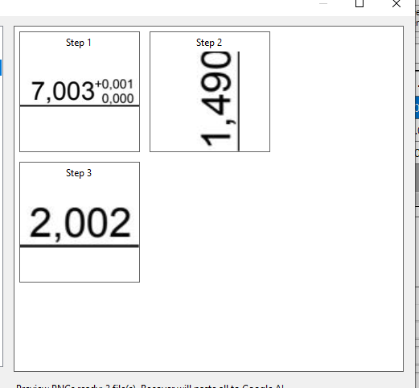

# DimensionOCR

DimensionOCR is a Windows PDF drawing OCR tool for extracting mechanical dimension callouts, reviewing MarkStep results, correcting tolerances, and exporting clean inspection data to Excel.

## Screenshots

| Main workspace | Bulk recovery preview |
| --- | --- |
|  |  |

| Contact sheet sent to AI | Google AI result format |
| --- | --- |
|  |  |

## What It Does

- Opens PDF drawings for dimension review.
- Detects dimension callouts from embedded PDF text layers.
- Supports manual crop correction for difficult callouts.
- Supports region-based Auto Map PDF ordering.
- Shows editable text-zone bounding boxes for cleanup before mapping.
- Tracks nominal value, minus tolerance, plus tolerance, duplicate marks, and important marks.
- Supports Bulk Google AI Recovery through one contact-sheet image.
- Provides tolerance presets for common drawing formats.
- Exports reviewed results to Excel.
- Prints marked drawings directly from the app.

## Quick Start

1. Download the latest release package.
2. Extract the package to any folder.
3. Open the release folder.
4. Run `DimensionOcr.exe`, or use `Run-RapidOcrProUpdate-PS7.bat`.
5. Click `Open PDF`, or drag a PDF into the app.
6. Review OCR rows on the right side.
7. Clean text zones or use Bulk Google AI Recovery when needed.
8. Click `Export Excel` when the table is ready.

## Auto Map PDF Regions

Auto Map PDF uses the PDF text layer and lets the operator choose mapping order manually.

1. Click `Auto Map PDF`.
2. Drag Region 1, Region 2, and any later regions in the desired inspection order.
3. Use `Text Zones`, `Clear Gray Box`, and `Delete BBox` to clean bad boxes before finishing.
4. Check duplicate warnings inside the selected regions.
5. Click `Finish` to create MarkSteps in region order.

## Bulk Google AI Recovery

Bulk recovery is useful when OCR reads several dimensions incorrectly.

1. Select the rows that need recovery.
2. Open `Advance` then choose `Bulk Google AI Recovery`.
3. Check the steps you want to recover.
4. Review the crop previews.
5. Click `Recover`.
6. The app prepares one contact-sheet image and sends it to Google AI.
7. The returned values are parsed back into the table.

Expected AI result format:

```text
STEP=1 Nominal=7,003 Tol+=0,001 Tol-=0,000
STEP=2 Nominal=1,490 Tol+=0,000 Tol-=0,000
STEP=3 Nominal=2,002 Tol+=0,000 Tol-=0,000
```

## Keyboard Shortcuts

| Key | Action |
| --- | --- |
| `T` | Toggle Text Zones |
| `C` | Toggle Copy View |
| `Space` hold | Pan Mode |
| `Middle Mouse Drag` | Pan Drawing |
| `Mouse Wheel` | Zoom at cursor |
| `Shift + Mouse Wheel` | Horizontal scroll |
| `Esc` | Cancel selection |
| `Enter` | Accept hidden text-zone suggestion |
| `E` | Keep hidden duplicate candidate as new |
| `Ctrl + Shift + R` | Rotate page 90 degrees |
| `Ctrl + B` | Toggle side panel |
| `Ctrl + S` | Google AI recovery for selected step |
| `Ctrl + P` | Print current marked drawing |
| `Ctrl + Z` | Undo deleted step |
| `Ctrl + C` | Copy selected mark |
| `Ctrl + V` | Paste selected mark |
| `Ctrl + D` | Duplicate selected text zone |
| `Ctrl + 0` | Fit screen |
| `Ctrl + 1` | Actual size |
| `+` | Increase balloon size |
| `-` | Decrease balloon size |
| `Delete` | Delete selected item |

## Main Files

- `RapidOcrProUpdate.ps1` - main application logic.
- `RapidOcrProUpdate.UI.ps1` - Windows Forms interface.
- `Run-RapidOcrProUpdate-PS7.bat` - launcher for PowerShell 7.
- `WindowsOcr_Helper.ps1` - Windows OCR helper.

## Platform

- Windows desktop
- PowerShell 7
- PDF drawing workflow
- Excel export workflow

## Project Status

Active development.
