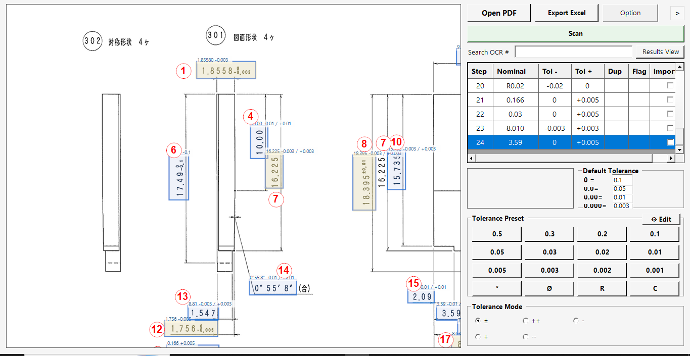
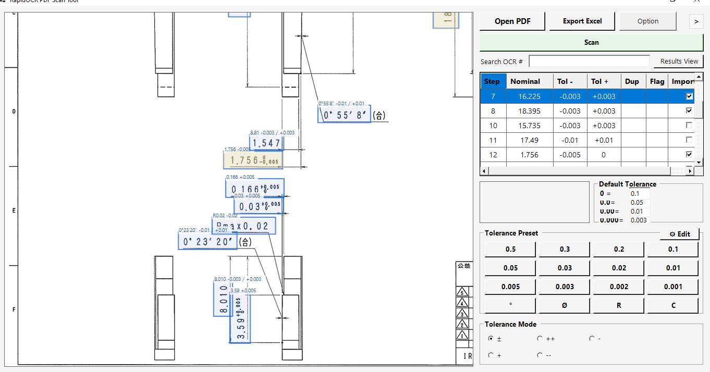
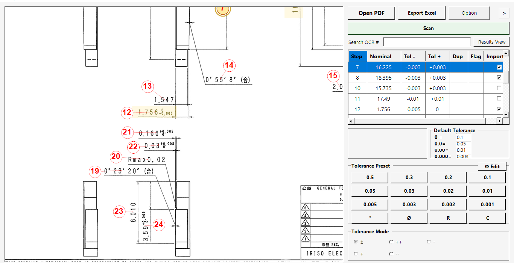
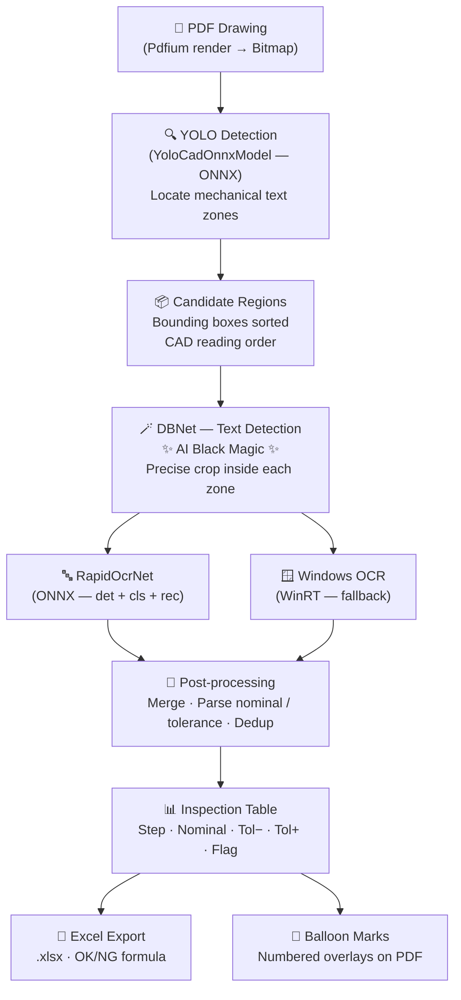
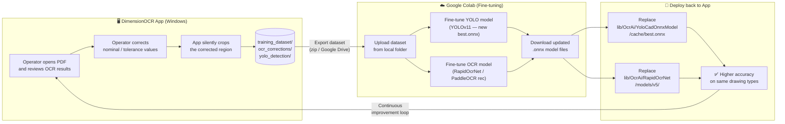

# DimensionOCR — RapidOCR PDF Scan Tool

**A Windows desktop tool for extracting mechanical dimensions from PDF drawings, reviewing OCR results, correcting tolerances, and exporting inspection data to Excel.**

---

## Screenshots

**Main workspace — balloon marks & dimension table**



**Auto Scan result — YOLO detection with numbered balloons**





---

## OCR Pipeline


```mermaid
flowchart TD
    A["📄 PDF Drawing\n(Pdfium render → Bitmap)"]
    B["🔍 YOLO Detection\n(YoloCadOnnxModel — ONNX)\nLocate mechanical text zones"]
    C["📦 Candidate Regions\nBounding boxes sorted\nCAD reading order"]
    D["🪄 DBNet — Text Detection\n✨ AI Black Magic ✨\nPrecise crop inside each zone"]
    F["🔤 RapidOcrNet\n(ONNX — det + cls + rec)"]
    G["🪟 Windows OCR\n(WinRT — fallback)"]
    H["🧹 Post-processing\nMerge · Parse nominal / tolerance · Dedup"]
    I["📊 Inspection Table\nStep · Nominal · Tol− · Tol+ · Flag"]
    J["📁 Excel Export\n.xlsx · OK/NG formula"]
    K["🎈 Balloon Marks\nNumbered overlays on PDF"]

    A --> B
    B --> C
    C --> D
    D --> F
    D --> G
    F --> H
    G --> H
    H --> I
    I --> J
    I --> K
```

---

## Features

| Category | Feature |
|----------|---------|
| **PDF** | Open / drag-drop mechanical PDF drawings, rendered via Pdfium |
| **Auto Scan** | YOLO ONNX detects text zones → RapidOcrNet reads dimensions, sorted in CAD reading order |
| **Manual crop** | Draw bounding boxes manually for difficult callouts |
| **Auto Map PDF** | Select inspection regions in order, generate MarkSteps per region |
| **Table editing** | Edit Nominal / Tol− / Tol+ / Tool / Result directly in the grid |
| **Duplicate detection** | Automatically flags duplicate dimension marks |
| **Balloon marks** | Numbered balloons drawn on the PDF, resizable, copy/paste/duplicate |
| **Bulk Google AI Recovery** | Sends a crop contact-sheet image to Google AI via Chrome → parses results back into the table |
| **Excel export** | Export inspection table to `.xlsx` with OK/NG formulas |
| **Print** | Print the marked drawing directly from the app (`Ctrl+P`) |
| **Training pipeline** | Silently collects OCR corrections and YOLO annotations for model retraining |
| **Session save/restore** | State is saved and restored per PDF file |
| **System tray** | Minimize to tray, restore on demand |

---

## Requirements

| Component | Requirement |
|-----------|------------|
| **OS** | Windows 10 / 11 (64-bit) |
| **PowerShell** | PowerShell 7 (`pwsh`) — recommended; Windows PowerShell 5.1 also works |
| **.NET Runtime** | .NET 8 (used by `RapidOcrNet.dll`, `YoloCadOnnxModel.dll`) |
| **Google Chrome** | Required for Bulk Google AI Recovery (Chrome automation) |

---

## Quick Start

```powershell
# Clone
git clone https://github.com/vuductho96/ScanDrawingOcr.git
cd ScanDrawingOcr

# Run
.\Run-RapidOcrProUpdate-PS7.bat
```

Or launch directly:

```powershell
pwsh -NoProfile -ExecutionPolicy Bypass -STA -File .\RapidOcrProUpdate.ps1
```

> The `-STA` flag is required for WinForms to function correctly.

---

## Usage

### Open a drawing

Click **Open PDF** or drag a PDF file into the window. Navigate pages using the top bar.

### Auto Scan (YOLO + RapidOCR)

Click **Scan** or go to **Advance → Auto Scan**:

1. YOLO ONNX detects mechanical text and dimension zones.
2. RapidOcrNet reads each zone.
3. Results are sorted in standard CAD reading order (top-to-bottom bands, left-to-right).
4. Numbered MarkSteps are created and balloons are placed on the drawing.
5. The table is filled automatically (Step / Nominal / Tol− / Tol+).

Press `T` to toggle text zone bounding box visibility.


### Manual editing

- Click any cell to edit Nominal / Tol− / Tol+ / Tool / Result directly.
- Drag bounding boxes on the drawing to adjust crop regions.
- Press `Ctrl+Z` to undo a deleted step.


### Export to Excel

Click **Export Excel** to export the inspection table to `.xlsx` with OK/NG formulas and standard mechanical tolerance formatting.

---

## Keyboard Shortcuts

| Key | Action |
|-----|--------|
| `T` | Toggle text zone bounding boxes |
| `C` | Toggle copy view |
| `B` | Toggle balloon view |
| `R` | Rotate page 90° clockwise |
| `L` | Toggle leader lines |
| `S` | Sort steps ascending |
| `I` | Mark selected step as Important |
| `E` | Keep hidden duplicate candidate as a new step |
| `Enter` | Accept hidden text-zone suggestion |
| `Esc` | Cancel current selection |
| `MiddleMouse` (hold) | Pan mode |
| `Ctrl + B` | Toggle side panel |
| `Ctrl + Z` | Undo deleted step |
| `Ctrl + C` | Copy selected mark |
| `Ctrl + V` | Paste mark |
| `Ctrl + D` | Duplicate selected text zone |
| `+` / `-` | Increase / decrease balloon size |
| `Delete` | Delete selected item |

---

## Project Structure

```
RapidOcrProUpdateBundle/
│
├── RapidOcrProUpdate.ps1            # Main script — business logic
├── RapidOcrProUpdate.UI.ps1         # Windows Forms UI module
├── RapidOcrProUpdate.Training.ps1   # Training data collection module
├── RapidOcrStartupSplash.hta        # Startup splash screen
├── Run-RapidOcrProUpdate-PS7.bat    # Launcher (visible console window)
├── Run-RapidOcrProUpdate-PS7.vbs    # Launcher (hidden, no console)
├── PdfiumViewer.dll                 # .NET PDF rendering wrapper
├── pdfium.dll                       # Pdfium native library (x64)
│
├── lib/
│   ├── OcrAi/
│   │   ├── RapidOcrNet/             # RapidOCR .NET engine
│   │   │   ├── lib/net8.0/          # RapidOcrNet.dll
│   │   │   └── models/v5/           # ONNX models (det, rec, cls)
│   │   ├── YoloCadOnnxModel/        # YOLO CAD detector (C# wrapper)
│   │   │   ├── cache/best.onnx      # Trained YOLO model
│   │   │   └── lib/net8.0/          # YoloCadOnnxModel.dll
│   │   ├── YoloCadDetector/         # YOLO inference wrapper
│   │   ├── Microsoft.ML.OnnxRuntime.*/ # ONNX Runtime
│   │   ├── SkiaSharp/               # Image processing (managed)
│   │   ├── SkiaSharp.NativeAssets.Win32/ # SkiaSharp native
│   │   ├── Clipper2/                # Polygon clipping
│   │   └── System.Numerics.Tensors/
│   └── OpenCvSharp/
│       ├── opencvsharp4/            # OpenCvSharp managed DLL
│       └── opencvsharp4.runtime.win/  # OpenCvSharpExtern.dll (native)
│
├── tools/
│   ├── autoscan_bridge.py           # Python bridge for Auto Scan
│   ├── cad_ocr_pipeline.py          # Full-page CAD OCR pipeline
│   ├── cad_geometric_preprocessor.py # Geometric pre-processing
│   ├── rapidocr_worker.ps1          # Parallel OCR worker process
│   └── Capture2Text/
│       └── Capture2Text_463/        # Capture2Text binary (OCR fallback)
├── SecureBuild/                     # EXE wrapper build (encrypted script)
│   ├── Loader/                      # C# loader — decrypts payload.dat in memory
│   ├── EncryptTool/                 # Encrypts .ps1 → payload.dat
│   └── README.md                    # Build instructions
│
├── docs/
│   └── assets/                      # README screenshots
│
└── .gitignore
```

---

## Building the EXE Distribution

To distribute as a standalone `.exe` with the PowerShell source encrypted:

```powershell
cd SecureBuild

# Restore NuGet packages
dotnet restore .\Loader\SecurePs1Loader.csproj
dotnet restore .\EncryptTool\EncryptTool.csproj

# Publish both projects
dotnet publish .\Loader\SecurePs1Loader.csproj -c Release -r win-x64
dotnet publish .\EncryptTool\EncryptTool.csproj -c Release -r win-x64

# Encrypt scripts into payload.dat
.\EncryptTool\bin\Release\net8.0\win-x64\publish\EncryptTool.exe `
    ..\RapidOcrProUpdate.ps1 `
    .\Release-SimpleDrag\payload.dat

# Copy runtime dependencies
.\Copy-AppSupportFiles.ps1
```

> The loader never writes the decrypted script to disk — it runs entirely in memory.  
> See [`SecureBuild/README.md`](SecureBuild/README.md) for full details.

---

## Self-Improving Training Pipeline

The app **automatically collects its own training data** while operators use it — no manual labeling required.
Every OCR correction and every confirmed text zone is silently saved as a training sample in the background.
This data is then used to fine-tune both the YOLO detection model and the OCR recognition model via **Google Colab**,
so the system gets more accurate over time for each specific drawing style.


```mermaid
flowchart LR
    subgraph APP ["🖥️  DimensionOCR App  (Windows)"]
        A["Operator opens PDF\nand reviews OCR results"]
        B["Operator corrects\nnominal / tolerance values"]
        C["App silently crops\nthe corrected region"]
        D[("training_dataset/\nocr_corrections/\nyolo_detection/")]
    end

    subgraph COLAB ["☁️  Google Colab  (Fine-tuning)"]
        E["Upload dataset\nfrom local folder"]
        F["Fine-tune YOLO model\n(YOLOv11 — new best.onnx)"]
        G["Fine-tune OCR model\n(RapidOcrNet / PaddleOCR rec)"]
        H["Download updated\n.onnx model files"]
    end

    subgraph DEPLOY ["🔄  Deploy back to App"]
        I["Replace\nlib/OcrAi/YoloCadOnnxModel\n/cache/best.onnx"]
        J["Replace\nlib/OcrAi/RapidOcrNet\n/models/v5/"]
        K["✅ Higher accuracy\non same drawing types"]
    end

    A --> B --> C --> D
    D -- "Export dataset\n(zip / Google Drive)" --> E
    E --> F --> H
    E --> G --> H
    H --> I --> K
    H --> J --> K
    K -- "Continuous\nimprovement loop" --> A
```

### What gets collected automatically

| Dataset folder | Content | Used to train |
|----------------|---------|--------------|
| `training_dataset/ocr_corrections/` | Cropped zone images + corrected text labels | OCR recognition model (RapidOcrNet) |
| `training_dataset/yolo_detection/` | Full page images + YOLO bounding box annotations | YOLO detection model |

### Fine-tuning on Google Colab

1. Export the `training_dataset/` folder (zip or sync to Google Drive).
2. Open the provided Colab notebooks.
3. Run training — Colab GPU handles the heavy compute.
4. Download the new `best.onnx` files.
5. Replace the model files in `lib/OcrAi/YoloCadOnnxModel/cache/` and `lib/OcrAi/RapidOcrNet/models/v5/`.
6. The app picks up the new models on next launch — no rebuild required.

---

## Status

**Active development.**
