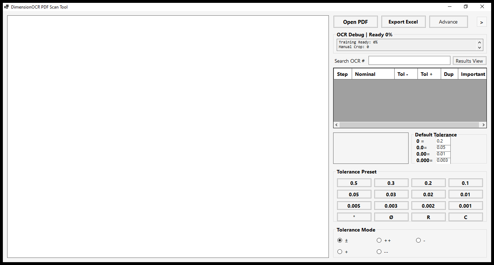
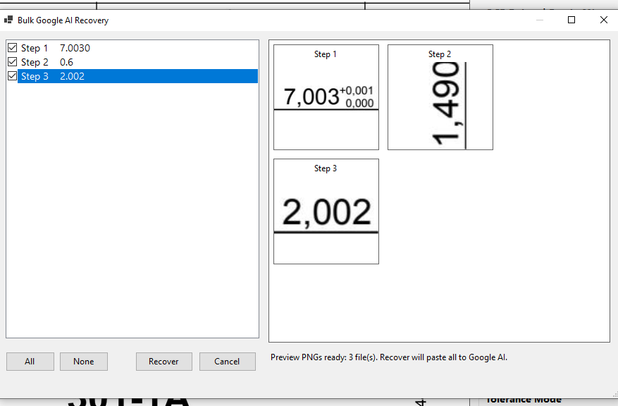
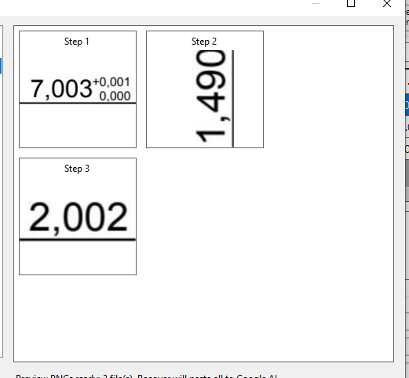
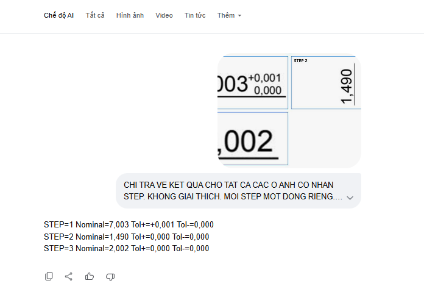

# RapidOCR PDF Scan Tool — DimensionOCR

> **Công cụ OCR bản vẽ PDF cơ khí trên Windows** — trích xuất kích thước, dung sai, duyệt kết quả và xuất Excel kiểm tra.

---

## Tính năng chính

| Nhóm | Tính năng |
|------|-----------|
| **PDF** | Mở / kéo thả PDF bản vẽ cơ khí, render trang với Pdfium |
| **OCR tự động** | YOLO ONNX (C# wrapper) phát hiện text-zone → RapidOcrNet / Windows OCR |
| **Auto Scan** | Quét toàn trang tự động bằng YOLO + RapidOCR, sắp xếp theo thứ tự đọc CAD |
| **Manual crop** | Vẽ bounding box tay cho các vùng OCR khó |
| **Auto Map PDF** | Chọn vùng theo thứ tự kiểm tra, tạo MarkStep theo vùng |
| **Duyệt bảng** | Chỉnh sửa Nominal / Tol− / Tol+ / Tool / Result trực tiếp trên bảng |
| **Duplicate detect** | Phát hiện và đánh dấu dimension trùng tự động |
| **Balloon** | Vẽ số balloon trên bản vẽ, điều chỉnh kích thước, copy/paste/duplicate |
| **Bulk Google AI Recovery** | Gửi contact-sheet ảnh qua Chrome → Google AI → parse kết quả hàng loạt |
| **Excel export** | Xuất bảng kiểm tra sang `.xlsx` (có formula OK/NG, định dạng chuẩn) |
| **In ấn** | In bản vẽ đã đánh dấu trực tiếp từ app (`Ctrl+P`) |
| **Training pipeline** | Tự động thu thập dữ liệu training (OCR correction, YOLO annotation) trong nền |
| **Session** | Lưu/khôi phục trạng thái làm việc theo file PDF |
| **Tray icon** | Chạy ẩn hệ thống, hiện lại khi cần |

---

## Ảnh chụp màn hình

| Workspace chính | Bulk Recovery |
|---|---|
|  |  |

| Contact sheet gửi AI | Kết quả trả về từ Google AI |
|---|---|
|  |  |

---

## Yêu cầu hệ thống

| Thành phần | Yêu cầu |
|------------|---------|
| **OS** | Windows 10 / 11 (64-bit) |
| **PowerShell** | PowerShell 7 (`pwsh`) — khuyến nghị; hoặc Windows PowerShell 5.1 |
| **.NET Runtime** | .NET 8 (dùng bởi `RapidOcrNet.dll`, `YoloCadOnnxModel.dll`) |
| **Google Chrome** | Cần thiết cho tính năng Bulk Google AI Recovery (tự động hoá qua Chrome) |

---

## Cài đặt nhanh

```powershell
# Clone repo
git clone https://github.com/vuductho96/ScanDrawingOcr.git
cd ScanDrawingOcr

# Chạy app
.\Run-RapidOcrProUpdate-PS7.bat
```

Hoặc chạy trực tiếp bằng PowerShell:

```powershell
pwsh -NoProfile -ExecutionPolicy Bypass -STA -File .\RapidOcrProUpdate.ps1
```

> **Lưu ý:** App cần chạy với `-STA` (Single-Threaded Apartment) để WinForms hoạt động đúng.

---

## Hướng dẫn sử dụng

### 1 · Mở bản vẽ

- Click **Open PDF**, hoặc **kéo thả file PDF** vào cửa sổ.
- Điều hướng trang bằng thanh ở góc trên.

### 2 · Auto Scan (YOLO + RapidOCR)

Click **Auto Scan** hoặc vào **Advance → Auto Scan**:

1. Chạy YOLO ONNX phát hiện text/dimension zones trên trang.
2. Đọc OCR từng zone bằng RapidOcrNet.
3. Sắp xếp theo thứ tự đọc CAD chuẩn (top-to-bottom, left-to-right).
4. Tạo MarkStep có đánh số, đặt balloon lên bản vẽ.
5. Điền tự động vào bảng (Step / Nominal / Tol− / Tol+).

Nhấn `T` để bật/tắt hiển thị bounding box text zone.

### 3 · Auto Map PDF theo vùng

1. Click **Auto Map PDF**.
2. Kéo vùng Region 1, Region 2, … theo thứ tự kiểm tra.
3. Dùng **Text Zones**, **Clear Gray Box**, **Delete BBox** để làm sạch box xấu.
4. Kiểm tra cảnh báo duplicate trong vùng đã chọn.
5. Click **Finish** để tạo MarkStep theo thứ tự vùng.

### 4 · Sửa thủ công

- Click vào ô bảng để sửa trực tiếp Nominal / Tol− / Tol+ / Tool / Result.
- Kéo bounding box trên bản vẽ để điều chỉnh vùng crop.
- Dùng `Ctrl + Z` để undo xoá step.

### 5 · Bulk Google AI Recovery

Dùng khi OCR đọc sai nhiều dimension cùng lúc:

1. Chọn các row cần recovery.
2. Mở **Advance → Bulk Google AI Recovery**.
3. Chọn các step cần phục hồi, xem preview crop.
4. Click **Recover** — app tạo một contact-sheet image và gửi lên Google AI qua Chrome.
5. Kết quả tự động parse và điền vào bảng.

**Định dạng kết quả AI:**

```
STEP=1 Nominal=7,003 Tol+=0,001 Tol-=0,000
STEP=2 Nominal=1,490 Tol+=0,000 Tol-=0,000
STEP=3 Nominal=2,002 Tol+=0,000 Tol-=0,000
```

### 6 · Xuất Excel

Click **Export Excel** để xuất bảng kết quả kiểm tra sang `.xlsx`:
- Có công thức OK/NG tự động.
- Định dạng tolerance chuẩn cơ khí.

---

## Phím tắt

| Phím | Chức năng |
|------|-----------|
| `T` | Bật/tắt hiển thị Text Zones |
| `C` | Bật/tắt Copy View |
| `B` | Bật/tắt Balloon View |
| `R` | Xoay trang 90° (clockwise) |
| `L` | Bật/tắt Leader Line |
| `S` | Sắp xếp các step tăng dần |
| `I` | Đánh dấu step là Important |
| `E` | Giữ duplicate candidate ẩn làm step mới |
| `Enter` | Chấp nhận gợi ý text-zone ẩn |
| `Esc` | Huỷ selection |
| `Space` (giữ) | Chế độ Pan |
| `Middle Mouse Drag` | Pan bản vẽ |
| `Mouse Wheel` | Zoom tại con trỏ |
| `Shift + Mouse Wheel` | Cuộn ngang |
| `Ctrl + B` | Bật/tắt side panel |
| `Ctrl + P` | In bản vẽ đã đánh dấu |
| `Ctrl + Z` | Undo xoá step |
| `Ctrl + C` | Copy mark đang chọn |
| `Ctrl + V` | Paste mark |
| `Ctrl + D` | Duplicate text zone |
| `Ctrl + 0` | Fit screen |
| `Ctrl + 1` | Kích thước thực (100%) |
| `+` / `-` | Tăng / giảm kích thước balloon |
| `Delete` | Xoá item đang chọn |

---

## Cấu trúc dự án

```
RapidOcrProUpdateBundle/
│
├── RapidOcrProUpdate.ps1          # Script chính — logic nghiệp vụ
├── RapidOcrProUpdate.UI.ps1       # Module giao diện Windows Forms
├── RapidOcrProUpdate.Training.ps1 # Module thu thập dữ liệu training
├── WindowsOcr_Helper.ps1          # Helper Windows OCR (WinRT API)
├── RapidOcrStartupSplash.hta      # Màn hình splash khi khởi động
│
├── Run-RapidOcrProUpdate-PS7.bat  # Launcher (BAT — hiện cửa sổ)
├── Run-RapidOcrProUpdate-PS7.vbs  # Launcher (VBS — chạy ẩn)
│
├── PdfiumViewer.dll               # .NET wrapper render PDF
├── pdfium.dll                     # Pdfium native (x64)
│
├── lib/
│   ├── OcrAi/
│   │   ├── RapidOcrNet/           # RapidOCR .NET (detect + recognize)
│   │   │   ├── lib/net8.0/        # RapidOcrNet.dll
│   │   │   └── models/v5/         # Model ONNX (det, rec, cls)
│   │   ├── YoloCadOnnxModel/      # YOLO CAD detector (C# wrapper)
│   │   │   ├── cache/best.onnx    # Model YOLO đã train
│   │   │   ├── lib/net8.0/        # YoloCadOnnxModel.dll
│   │   │   └── src/               # Source C# wrapper
│   │   ├── YoloCadDetector/       # Wrapper inference YOLO
│   │   ├── Microsoft.ML.OnnxRuntime.*/ # ONNX Runtime (native + managed)
│   │   ├── SkiaSharp/             # Xử lý ảnh (managed)
│   │   ├── SkiaSharp.NativeAssets.Win32/ # Native SkiaSharp
│   │   ├── Clipper2/              # Polygon clipping
│   │   └── System.Numerics.Tensors/
│   └── OpenCvSharp/
│       ├── opencvsharp4/          # OpenCvSharp managed
│       └── opencvsharp4.runtime.win/  # OpenCvSharpExtern.dll (native)
│
├── tools/
│   ├── autoscan_bridge.py         # Bridge Python cho Auto Scan
│   ├── cad_ocr_pipeline.py        # Pipeline OCR toàn bộ bản vẽ CAD
│   ├── cad_geometric_preprocessor.py  # Tiền xử lý hình học
│   ├── rapidocr_worker.ps1        # Worker process OCR song song
│   └── Capture2Text/
│       └── Capture2Text_463/      # Capture2Text binary (OCR fallback)
│
├── SecureBuild/                   # Build wrapper EXE (mã hoá script)
│   ├── Loader/                    # C# loader giải mã payload.dat
│   ├── EncryptTool/               # Tool mã hoá .ps1 → payload.dat
│   └── README.md                  # Hướng dẫn build EXE
│
├── docs/
│   └── assets/                    # Ảnh cho README
│
└── .gitignore
```

---

## Build EXE (phân phối đã mã hoá)

```powershell
cd SecureBuild

# Restore NuGet
dotnet restore .\Loader\SecurePs1Loader.csproj
dotnet restore .\EncryptTool\EncryptTool.csproj

# Publish
dotnet publish .\Loader\SecurePs1Loader.csproj -c Release -r win-x64
dotnet publish .\EncryptTool\EncryptTool.csproj -c Release -r win-x64

# Mã hoá scripts thành payload.dat
.\EncryptTool\bin\Release\net8.0\win-x64\publish\EncryptTool.exe `
    ..\RapidOcrProUpdate.ps1 `
    .\Release-SimpleDrag\payload.dat

# Copy dependencies
.\Copy-AppSupportFiles.ps1
```

> Script `.ps1` không bao giờ được ghi ra disk — chỉ giải mã trong bộ nhớ.  
> Xem chi tiết tại [`SecureBuild/README.md`](SecureBuild/README.md).

---

## Training pipeline

App tự động thu thập dữ liệu training trong nền khi người dùng sửa OCR:

- **OCR corrections** → `training_dataset/ocr_corrections/` (ảnh crop + nhãn đúng)
- **YOLO annotations** → `training_dataset/yolo_detection/` (ảnh + YOLO label)
- Trạng thái sẵn sàng training được hiển thị trên UI.

---

## Trạng thái dự án

**Đang phát triển tích cực.**
